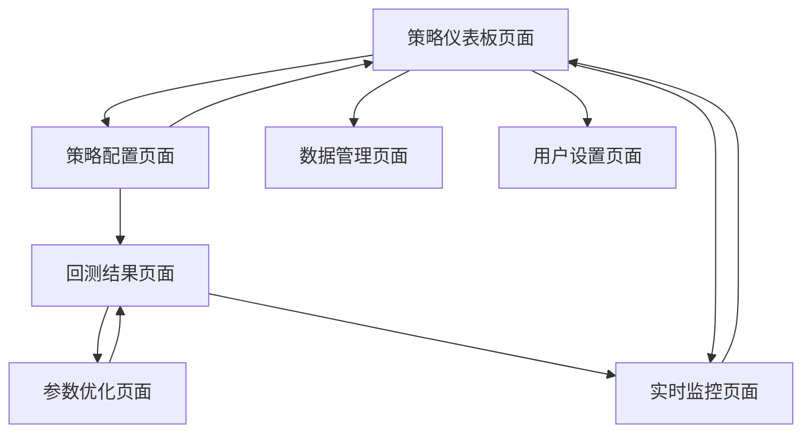

# 加密量化交易策略回测系统 - 产品需求文档

## 1. Product Overview

本产品是一个专业的加密货币量化交易策略回测与优化平台，为量化交易者提供策略开发、回测验证、参数优化和实时监控的一站式解决方案。

- 解决量化交易策略开发中的回测验证、参数调优、风险控制等核心问题，服务于专业交易员、量化基金和个人投资者。
- 通过可视化界面和自动化工具，大幅提升策略开发效率，降低量化交易的技术门槛。
- 目标成为加密货币量化交易领域的专业级策略开发平台，支撑用户实现稳定盈利。

## 2. Core Features

### 2.1 User Roles

| Role | Registration Method | Core Permissions |
|------|---------------------|------------------|
| 普通用户 | 邮箱注册 | 查看预设策略、基础回测功能、有限参数调优 |
| 专业用户 | 付费升级 | 自定义策略、高级回测、无限参数优化、实时监控 |
| 管理员 | 系统分配 | 用户管理、系统配置、数据管理、策略审核 |

### 2.2 Feature Module

我们的加密量化交易策略回测系统包含以下主要页面：

1. **策略仪表板页面**：策略概览、实时监控、快速操作入口
2. **策略配置页面**：策略选择、参数设置、回测配置
3. **回测结果页面**：资金曲线图表、绩效指标、交易记录详情
4. **参数优化页面**：参数范围设置、优化进度、最优参数展示
5. **实时监控页面**：实时价格、信号提醒、持仓状态
6. **数据管理页面**：历史数据导入、数据质量检查、数据源配置
7. **用户设置页面**：账户信息、交易配置、风险参数设置

### 2.3 Page Details

| Page Name | Module Name | Feature description |
|-----------|-------------|---------------------|
| 策略仪表板页面 | 策略概览模块 | 展示所有策略的核心指标、收益率排行、运行状态统计 |
| 策略仪表板页面 | 实时监控模块 | 显示当前活跃策略的实时盈亏、持仓状态、最新信号 |
| 策略仪表板页面 | 快速操作模块 | 提供策略启停、紧急平仓、快速回测等一键操作 |
| 策略配置页面 | 策略选择模块 | 选择布林线、海龟、RSI等预设策略或自定义策略 |
| 策略配置页面 | 参数设置模块 | 配置策略参数（如布林线周期、倍数）、交易参数（杠杆、手续费） |
| 策略配置页面 | 回测配置模块 | 设置回测时间范围、初始资金、交易品种、数据周期 |
| 回测结果页面 | 资金曲线模块 | 交互式图表展示资金曲线、最大回撤、收益率变化 |
| 回测结果页面 | 绩效指标模块 | 显示年化收益率、夏普比率、最大回撤、胜率等关键指标 |
| 回测结果页面 | 交易记录模块 | 详细交易记录表格、买卖点标注、盈亏分析 |
| 参数优化页面 | 参数范围设置模块 | 设置参数优化范围、步长、优化目标（收益率/夏普比率） |
| 参数优化页面 | 优化进度模块 | 实时显示优化进度、已完成组合数、预计剩余时间 |
| 参数优化页面 | 结果展示模块 | 参数热力图、最优参数组合、绩效对比分析 |
| 实时监控页面 | 价格监控模块 | 实时K线图、技术指标叠加、价格预警设置 |
| 实时监控页面 | 信号提醒模块 | 买卖信号实时推送、邮件/短信通知、信号历史记录 |
| 实时监控页面 | 持仓管理模块 | 当前持仓展示、盈亏统计、风险控制状态 |
| 数据管理页面 | 数据导入模块 | 支持CSV/Excel数据导入、数据格式验证、批量处理 |
| 数据管理页面 | 数据质量模块 | 数据完整性检查、异常值检测、数据清洗建议 |
| 数据管理页面 | 数据源配置模块 | 配置交易所API、数据更新频率、数据存储设置 |
| 用户设置页面 | 账户信息模块 | 个人信息管理、密码修改、账户安全设置 |
| 用户设置页面 | 交易配置模块 | 默认交易参数、风险偏好设置、通知偏好配置 |
| 用户设置页面 | 系统设置模块 | 界面主题、语言设置、数据备份恢复 |

## 3. Core Process

### 普通用户流程
用户首先在策略仪表板查看系统概况，然后进入策略配置页面选择预设策略（如布林线策略）并设置基础参数，配置完成后启动回测，在回测结果页面查看资金曲线和绩效指标，根据结果调整参数并重新回测，满意后可在实时监控页面观察策略实时表现。

### 专业用户流程
专业用户除了基础流程外，还可以使用参数优化功能进行大规模参数扫描，找到最优参数组合，同时可以在数据管理页面导入自定义数据源，配置更复杂的策略参数，并设置更精细的风险控制规则。

### 管理员流程
管理员通过用户设置页面管理用户权限，在数据管理页面维护系统数据质量，监控系统运行状态，审核用户提交的自定义策略，确保系统稳定运行。

## 4. User Interface Design

### 4.1 Design Style

- **主色调**：深蓝色 (#1a365d) 作为主色，金色 (#ffd700) 作为强调色，体现专业性和财富属性
- **辅助色**：浅灰色 (#f7fafc) 背景，深灰色 (#2d3748) 文字，绿色 (#38a169) 盈利，红色 (#e53e3e) 亏损
- **按钮风格**：现代扁平化设计，圆角 8px，悬停时有微妙阴影效果
- **字体**：中文使用 "PingFang SC"，英文使用 "Inter"，代码使用 "JetBrains Mono"
- **布局风格**：卡片式布局，左侧导航栏，顶部工具栏，响应式网格系统
- **图标风格**：线性图标风格，统一使用 Lucide 图标库，保持视觉一致性

### 4.2 Page Design Overview

| Page Name | Module Name | UI Elements |
|-----------|-------------|-------------|
| 策略仪表板页面 | 策略概览模块 | 卡片网格布局，每个策略一张卡片，包含收益率进度条、状态指示灯、快速操作按钮 |
| 策略仪表板页面 | 实时监控模块 | 大屏数字显示当前盈亏，使用绿红色彩区分，配合动态图表展示趋势 |
| 策略配置页面 | 参数设置模块 | 表单式布局，滑块和输入框结合，实时参数预览，参数说明悬浮提示 |
| 回测结果页面 | 资金曲线模块 | 全屏交互式图表，支持缩放平移，多时间周期切换，技术指标叠加显示 |
| 回测结果页面 | 绩效指标模块 | 指标卡片网格，关键数字突出显示，颜色编码表示好坏，趋势箭头指示 |
| 参数优化页面 | 结果展示模块 | 热力图可视化，颜色深浅表示绩效，支持参数维度切换，最优点高亮标注 |
| 实时监控页面 | 价格监控模块 | K线图表占据主要区域，侧边栏显示技术指标，底部时间轴控制 |
| 数据管理页面 | 数据导入模块 | 拖拽上传区域，进度条显示处理状态，数据预览表格，错误信息高亮提示 |

### 4.3 Responsiveness

产品采用桌面优先设计，同时支持平板和移动端适配。在移动端，导航栏收缩为汉堡菜单，图表自动调整为触摸友好的交互方式，表格支持横向滚动，关键操作按钮放大以适应触摸操作。