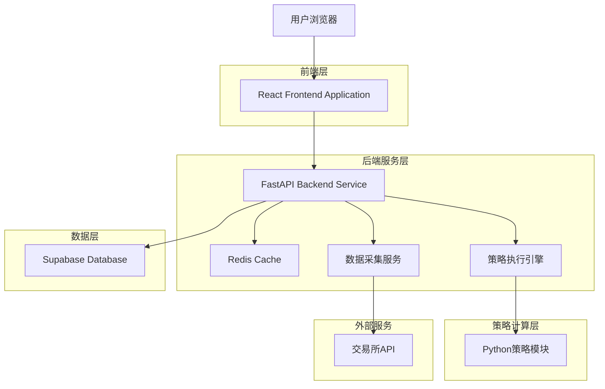
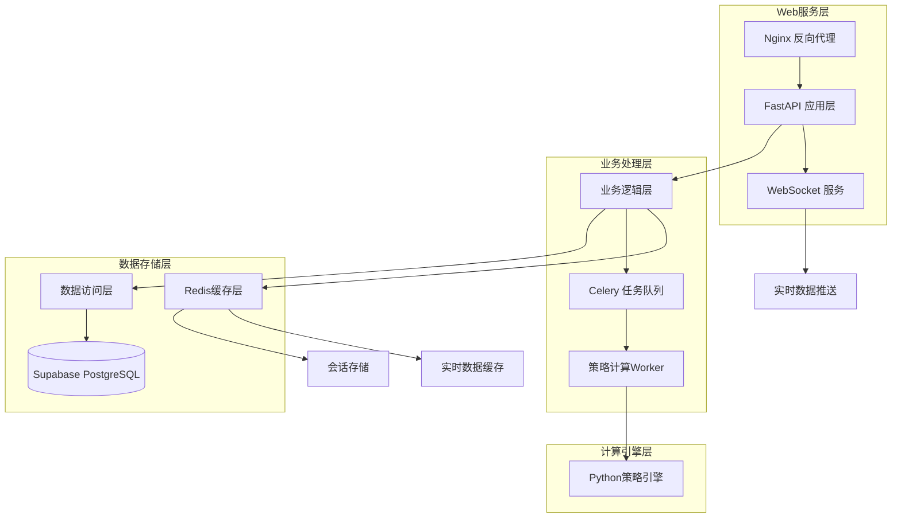
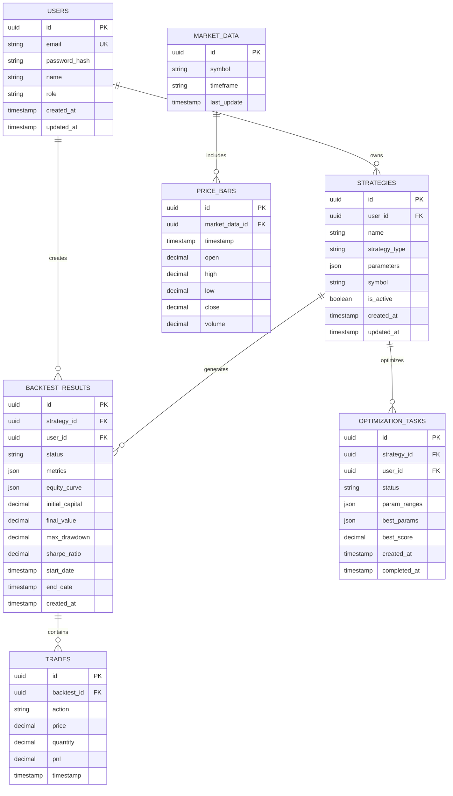

# 加密量化交易策略回测系统 - 技术架构文档

## 1. Architecture design



## 2. Technology Description

* Frontend: React\@18 + TypeScript + Vite + TailwindCSS + Recharts + Zustand

* Backend: FastAPI\@0.104 + Python\@3.11.9 + Celery + WebSocket

* Database: Supabase (PostgreSQL) + Redis\@7

* Strategy Engine: Pandas + NumPy + TA-Lib + Numba

* Data Sources: CCXT + WebSocket APIs

* Deployment: Docker + Nginx + PM2

## 3. Route definitions

| Route                     | Purpose               |
| ------------------------- | --------------------- |
| /                         | 策略仪表板页面，展示所有策略概览和实时监控 |
| /strategy/config          | 策略配置页面，选择和配置交易策略参数    |
| /backtest/results/:id     | 回测结果页面，显示特定回测的详细结果    |
| /optimization/:strategyId | 参数优化页面，进行策略参数批量优化     |
| /monitor/live             | 实时监控页面，监控活跃策略和市场数据    |
| /data/management          | 数据管理页面，管理历史数据和数据源     |
| /settings/profile         | 用户设置页面，管理账户和系统配置      |
| /auth/login               | 登录页面，用户身份验证           |
| /auth/register            | 注册页面，新用户注册            |

## 4. API definitions

### 4.1 Core API

**用户认证相关**

```
POST /api/auth/login
```

Request:

| Param Name | Param Type | isRequired | Description |
| ---------- | ---------- | ---------- | ----------- |
| email      | string     | true       | 用户邮箱地址      |
| password   | string     | true       | 用户密码        |

Response:

| Param Name | Param Type | Description |
| ---------- | ---------- | ----------- |
| success    | boolean    | 登录是否成功      |
| token      | string     | JWT访问令牌     |
| user       | object     | 用户基本信息      |

Example:

```json
{
  "email": "trader@example.com",
  "password": "securePassword123"
}
```

**策略管理相关**

```
GET /api/strategies
```

Response:

| Param Name | Param Type | Description |
| ---------- | ---------- | ----------- |
| strategies | array      | 策略列表        |
| total      | number     | 策略总数        |

```
POST /api/strategies
```

Request:

| Param Name | Param Type | isRequired | Description               |
| ---------- | ---------- | ---------- | ------------------------- |
| name       | string     | true       | 策略名称                      |
| type       | string     | true       | 策略类型 (bolling/turtle/rsi) |
| parameters | object     | true       | 策略参数配置                    |
| symbol     | string     | true       | 交易品种                      |

**回测相关**

```
POST /api/backtest/run
```

Request:

| Param Name       | Param Type | isRequired | Description |
| ---------------- | ---------- | ---------- | ----------- |
| strategy\_id     | string     | true       | 策略ID        |
| start\_date      | string     | true       | 回测开始日期      |
| end\_date        | string     | true       | 回测结束日期      |
| initial\_capital | number     | true       | 初始资金        |
| leverage         | number     | false      | 杠杆倍数        |

Response:

| Param Name | Param Type | Description |
| ---------- | ---------- | ----------- |
| task\_id   | string     | 异步任务ID      |
| status     | string     | 任务状态        |

```
GET /api/backtest/results/:task_id
```

Response:

| Param Name    | Param Type | Description |
| ------------- | ---------- | ----------- |
| equity\_curve | array      | 资金曲线数据      |
| metrics       | object     | 绩效指标        |
| trades        | array      | 交易记录        |
| status        | string     | 回测状态        |

**参数优化相关**

```
POST /api/optimization/start
```

Request:

| Param Name           | Param Type | isRequired | Description          |
| -------------------- | ---------- | ---------- | -------------------- |
| strategy\_type       | string     | true       | 策略类型                 |
| param\_ranges        | object     | true       | 参数范围配置               |
| optimization\_target | string     | true       | 优化目标 (return/sharpe) |

**实时数据相关**

```
WebSocket /ws/market/:symbol
```

推送数据格式:

| Param Name | Param Type | Description |
| ---------- | ---------- | ----------- |
| symbol     | string     | 交易品种        |
| price      | number     | 最新价格        |
| timestamp  | number     | 时间戳         |
| volume     | number     | 成交量         |

## 5. Server architecture diagram



## 6. Data model

### 6.1 Data model definition



### 6.2 Data Definition Language

**用户表 (users)**

```sql
-- 创建用户表
CREATE TABLE users (
    id UUID PRIMARY KEY DEFAULT gen_random_uuid(),
    email VARCHAR(255) UNIQUE NOT NULL,
    password_hash VARCHAR(255) NOT NULL,
    name VARCHAR(100) NOT NULL,
    role VARCHAR(20) DEFAULT 'user' CHECK (role IN ('user', 'premium', 'admin')),
    created_at TIMESTAMP WITH TIME ZONE DEFAULT NOW(),
    updated_at TIMESTAMP WITH TIME ZONE DEFAULT NOW()
);

-- 创建索引
CREATE INDEX idx_users_email ON users(email);
CREATE INDEX idx_users_role ON users(role);

-- 设置权限
GRANT SELECT ON users TO anon;
GRANT ALL PRIVILEGES ON users TO authenticated;
```

**策略表 (strategies)**

```sql
-- 创建策略表
CREATE TABLE strategies (
    id UUID PRIMARY KEY DEFAULT gen_random_uuid(),
    user_id UUID REFERENCES users(id) ON DELETE CASCADE,
    name VARCHAR(100) NOT NULL,
    strategy_type VARCHAR(50) NOT NULL CHECK (strategy_type IN ('bolling', 'turtle', 'rsi', 'custom')),
    parameters JSONB NOT NULL,
    symbol VARCHAR(20) NOT NULL,
    is_active BOOLEAN DEFAULT false,
    created_at TIMESTAMP WITH TIME ZONE DEFAULT NOW(),
    updated_at TIMESTAMP WITH TIME ZONE DEFAULT NOW()
);

-- 创建索引
CREATE INDEX idx_strategies_user_id ON strategies(user_id);
CREATE INDEX idx_strategies_type ON strategies(strategy_type);
CREATE INDEX idx_strategies_symbol ON strategies(symbol);
CREATE INDEX idx_strategies_active ON strategies(is_active);

-- 设置权限
GRANT SELECT ON strategies TO anon;
GRANT ALL PRIVILEGES ON strategies TO authenticated;
```

**回测结果表 (backtest\_results)**

```sql
-- 创建回测结果表
CREATE TABLE backtest_results (
    id UUID PRIMARY KEY DEFAULT gen_random_uuid(),
    strategy_id UUID REFERENCES strategies(id) ON DELETE CASCADE,
    user_id UUID REFERENCES users(id) ON DELETE CASCADE,
    status VARCHAR(20) DEFAULT 'pending' CHECK (status IN ('pending', 'running', 'completed', 'failed')),
    metrics JSONB,
    equity_curve JSONB,
    initial_capital DECIMAL(15,2) NOT NULL,
    final_value DECIMAL(15,2),
    max_drawdown DECIMAL(8,4),
    sharpe_ratio DECIMAL(8,4),
    start_date TIMESTAMP WITH TIME ZONE NOT NULL,
    end_date TIMESTAMP WITH TIME ZONE NOT NULL,
    created_at TIMESTAMP WITH TIME ZONE DEFAULT NOW()
);

-- 创建索引
CREATE INDEX idx_backtest_strategy_id ON backtest_results(strategy_id);
CREATE INDEX idx_backtest_user_id ON backtest_results(user_id);
CREATE INDEX idx_backtest_status ON backtest_results(status);
CREATE INDEX idx_backtest_created_at ON backtest_results(created_at DESC);

-- 设置权限
GRANT SELECT ON backtest_results TO anon;
GRANT ALL PRIVILEGES ON backtest_results TO authenticated;
```

**交易记录表 (trades)**

```sql
-- 创建交易记录表
CREATE TABLE trades (
    id UUID PRIMARY KEY DEFAULT gen_random_uuid(),
    backtest_id UUID REFERENCES backtest_results(id) ON DELETE CASCADE,
    action VARCHAR(10) NOT NULL CHECK (action IN ('buy', 'sell', 'long', 'short', 'close')),
    price DECIMAL(15,8) NOT NULL,
    quantity DECIMAL(15,8) NOT NULL,
    pnl DECIMAL(15,2),
    timestamp TIMESTAMP WITH TIME ZONE NOT NULL
);

-- 创建索引
CREATE INDEX idx_trades_backtest_id ON trades(backtest_id);
CREATE INDEX idx_trades_timestamp ON trades(timestamp);

-- 设置权限
GRANT SELECT ON trades TO anon;
GRANT ALL PRIVILEGES ON trades TO authenticated;
```

**市场数据表 (market\_data & price\_bars)**

```sql
-- 创建市场数据表
CREATE TABLE market_data (
    id UUID PRIMARY KEY DEFAULT gen_random_uuid(),
    symbol VARCHAR(20) NOT NULL,
    timeframe VARCHAR(10) NOT NULL,
    last_update TIMESTAMP WITH TIME ZONE DEFAULT NOW(),
    UNIQUE(symbol, timeframe)
);

-- 创建价格K线表
CREATE TABLE price_bars (
    id UUID PRIMARY KEY DEFAULT gen_random_uuid(),
    market_data_id UUID REFERENCES market_data(id) ON DELETE CASCADE,
    timestamp TIMESTAMP WITH TIME ZONE NOT NULL,
    open DECIMAL(15,8) NOT NULL,
    high DECIMAL(15,8) NOT NULL,
    low DECIMAL(15,8) NOT NULL,
    close DECIMAL(15,8) NOT NULL,
    volume DECIMAL(20,8) NOT NULL,
    UNIQUE(market_data_id, timestamp)
);

-- 创建索引
CREATE INDEX idx_market_data_symbol ON market_data(symbol);
CREATE INDEX idx_price_bars_market_data_id ON price_bars(market_data_id);
CREATE INDEX idx_price_bars_timestamp ON price_bars(timestamp DESC);

-- 设置权限
GRANT SELECT ON market_data TO anon;
GRANT ALL PRIVILEGES ON market_data TO authenticated;
GRANT SELECT ON price_bars TO anon;
GRANT ALL PRIVILEGES ON price_bars TO authenticated;
```

**初始化数据**

```sql
-- 插入示例策略类型
INSERT INTO strategies (user_id, name, strategy_type, parameters, symbol, is_active)
VALUES 
    (gen_random_uuid(), '布林线策略示例', 'bolling', '{"n": 400, "m": 2}', 'BTC-USDT', false),
    (gen_random_uuid(), '海龟策略示例', 'turtle', '{"n1": 20, "n2": 10}', 'BTC-USDT', false),
    (gen_random_uuid(), 'RSI策略示例', 'rsi', '{"period": 14, "upper": 70, "lower": 30}', 'BTC-USDT', false);

-- 插入示例市场数据
INSERT INTO market_data (symbol, timeframe)
VALUES 
    ('BTC-USDT', '5m'),
    ('BTC-USDT', '15m'),
    ('BTC-USDT', '1h'),
    ('ETH-USDT', '5m'),
    ('ETH-USDT', '15m');
```

